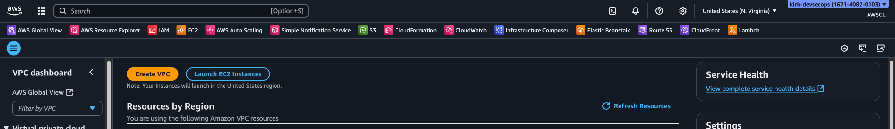
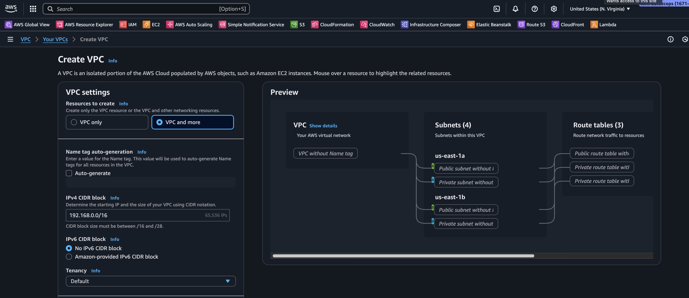
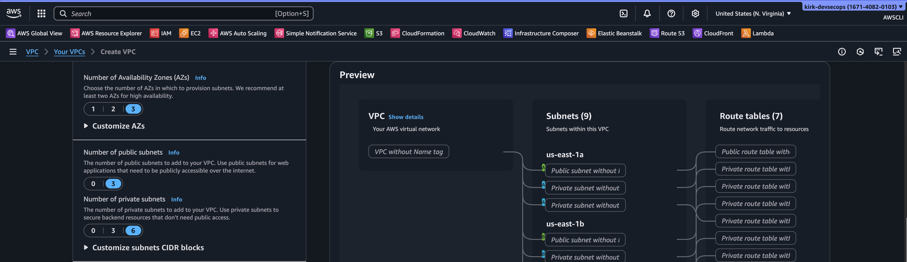
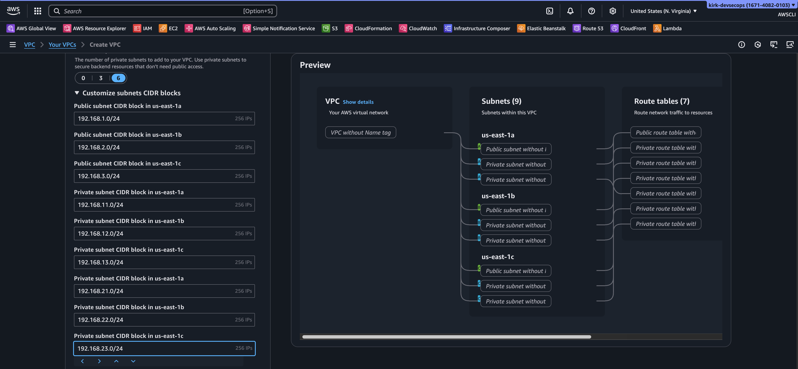
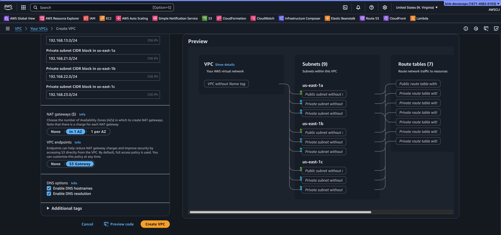
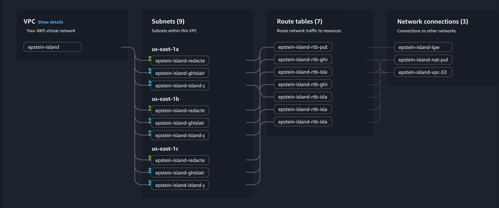
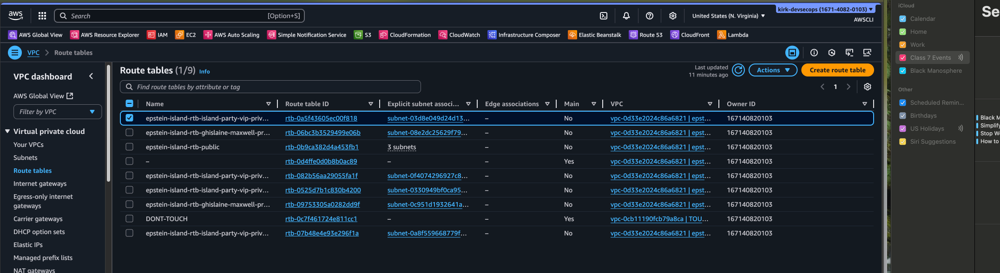
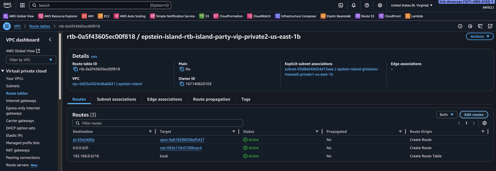
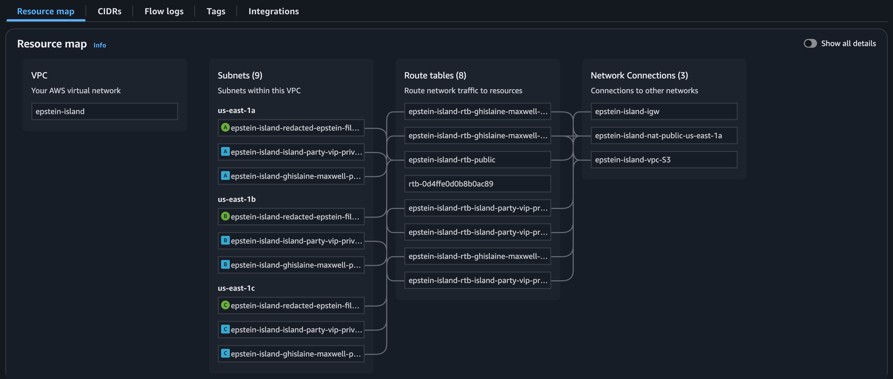

# Lab Title: Creating a Custom VPC
**Date:** 10-24-2025  
**Class:** Class. 7 AWS 

---
## Overview
**Purpose of lab:**  To build a fully isolated, production-style VPC architecture using multiple subnet tiers (public, private app, private data), route tables, and security groups to simulate real-world layered network segmentation.

**Key focus areas:**
- CIDR block planning for subnet ranges
- Route table rules for intra-VPC and internet-bound traffic
- Role-based subnet segmentation (Public → App → Data)
- Validating internal routing with public EC2 host.
- Mapping IP math to architecture design (usable IPs, subnet sizing)

**Initial thoughts:** This was a fun hands-on lab. We applied subnet theory in a practical way and made it easier to see how CIDR blocks map visually across subnets in a VPC. Deploying public and private EC2s on the VPC and testing with pings reinforced how route tables control traffic flow.
 
---
## Subnet Math
Before touching the AWS console, do the math for your VPC and subnets

- VPC CIDR: `192.168.0.0/16` (65,531 Total IPS)
- Subnets: Use `/24` blocks for each subnet. This gives 256 IPs each (easily accommodated inside `/16`)

Public Subnets (Public Layer, 3 AZs):
`192.168.1.0/24`
`192.168.2.0/24`
`192.168.3.0/24`

Private Subnets 1 (Private App Layer, 3 AZs):
`192.168.11.0/24`
`192.168.12.0/24`
`192.168.13.0/24`

Private Subnets 2 (Private Data Layer, 3 AZs):
`192.168.21.0/24`
`192.168.22.0/24`
`192.168.23.0/24`

---
## VPC Mapping
Pick a VPC name and region, then map it to your CIDR block.

VPC Name: epstein-island
Region: us-east-1
CIDR Block: `192.168.0.0/16`

---
## A Note about Naming  Subnets
>Pick subnet names that tell you what it is used for and where it is. A general naming system for 3-tier architecture would look something like:

```text
public-region-az
private-app-region-az
private-data-region-az
```

### Name Your Subnets
```text
Region: us-east-1a
epstein-island-redacted-epstein-files-public-us-east-1a
epstein-island-ghislaine-maxwell-private-app-us-east-1a
epstein-island-island-party-vip-private-data-us-east-1a

Region: us-east-1b
epstein-island-redacted-epstein-files-public-us-east-1b
epstein-island-ghislaine-maxwell-private-app-us-east-1b
epstein-island-island-party-vip-private-data-us-east-1b

Region: us-east-1c
epstein-island-redacted-epstein-files-public-us-east-1c
epstein-island-ghislaine-maxwell-private-app-us-east-1c
epstein-island-island-party-vip-private-data-us-east-1c
```

---
## Plan Gateways and Endpoints
Plan your VPC gateways and endpoint names before clicking through the UI.

```text
Internet Gateway: epstein-island-igw
NAT Gateway: epstein-island-nat-public-us-east-1a
VPC Endpoint (S3 Gateway Endpoint): epstein-island-vpc-S3
```

---
## Planning Route Tables
Assign all public subnets to a single route table. For private subnets, route tables should be allocated for each tier and each-AZ. Name them logically.

```text
Public Route Table:
epstein-island-rtb-public

Private App Route Tables:
epstein-island-rtb-ghislaine-maxwell-private-app-us-east-1a
epstein-island-rtb-ghislaine-maxwell-private-app-us-east-1b
epstein-island-rtb-ghislaine-maxwell-private-app-us-east-1c

Private Data Route Tables:
epstein-island-rtb-island-party-vip-private-data-us-east-1a
epstein-island-rtb-island-party-vip-private-data-us-east-1b
epstein-island-rtb-island-party-vip-private-data-us-east-1c
```

---
## Deploy Your VPC (Console Instructions)

### Launch the VPC Wizard
1. Go to **VPC Dashboard**
2. Click **Create VPC**
<br>

### VPC Settings and CIDR Block
1. Choose **"VPC and more"**
2. Manually name your VPC for full control (or use name tags)
3. Set VPC CIDR block to `192.168.0.0/16`
4. Do ***not*** add IPv6


### AZ and Subnet Configuration
1. Set **Availability Zones** to `3`
2. Create `3 public` and `6 private` subnets


### Subnet CIDR Blocks
1. Click **"Customize subnet CIDR blocks"** and input your `/24` blocks in the appropriate subnets


### NAT Gateway and VPC Endpoints
1. Select **NAT Gateway** `In 1 AZ`
2. Add **VPC Endpoint** `S3 Gateway`


### Name VPC Elements and Review
1. Once finished, name every element in your **VPC Resource Map** using your planned naming system.
2. Double-check your work. Then click **Create VPC**.


---
## Edit Private Data Route Tables
1. After the VPC is created, go to **Route Tables**

2. For **each private data-layer subnet**, edit its route table:
	- **Remove the NAT Gateway route**
    - This isolates the subnet from the internet and secures sensitive data.

3. Repeat this process for all **private data** subnets.

---
## Final Checks
- Click your VPC ID and  navigate to the  **Resource Map** then check to make sure:
	- Public subnets route to IGW
	- Private app subnets route to NAT GW + S3 endpoint
	- Private data subnets route **only** to S3 endpoint (no direct access to the internet)


---
## Deploy EC2s and Test Your VPC (Optional)
You can now test your architecture by launching EC2s with appropriate security groups into:
- Public subnet
	-  Test access to Internet with your method of choice (via public DNS link, SSH and pinging a public website like Google: `ping 8.8.8.8`, etc.)
- Private app subnet
	- Test outbound internet via NAT with your method of choice (e.g., test internet by updating EC2 with `sudo yum update -y`)
- Private data subnet
	- Confirm isolation (no internet)
	- SSH into a public EC2 then ping the private IP of an EC2 in the private data subnet to test connectivity within VPC `ping <IPV6-ADDRESS>`
	- Validate S3 access via endpoint

You can also practice deploying a 3-tier app by deploying:
- Load balancer in a public subnet
- EC2 instances with ASG in private subnet(s)
- RDS/Elasticache in private data subnets
- Establish private connections to Dynamo DB via VPC Gateway Endpoints

---
## Teardown Instructions
1. Terminate EC2 Instances (EC2 Console)
2. Delete NAT Gateway (VPC Console)
3. Release Elastic IP from the NAT Gateway (VPC Console)
4. Delete the VPC (VPC Console)
