# Epstein Island - VIP Island Party: Validating Network Isolation  🛩️🏝️👯‍♀️
**Date:** 10-18-2025  
**Class:** Class. 7 AWS 

---
## Overview
**Purpose of lab:**  To validate network segmentation, routing, and access control configurations in a multi-tier AWS VPC. The architecture is tested by deploying a Windows bastion host in a public subnet and multiple Linux clients in private subnets to verify secure connectivity and isolation between tiers.

**Key focus areas:**
- Routing and Connectivity Testing
	- Validate traffic flow (Public-App → Private-App) and confirm that Internet-bound traffic is restricted to the public application tier.
- Security Group and Access Control Validation
	- Verify ingress and egress rules. Testing will confirm security group configurations and subnet-level traffic flow enforcement.
- RDS Connectivity and Credential Management
	- Use an RDS client to test database connectivity from the application tier
	- Confirm secure handling of key pairs, credentials, and password management procedures.
- Bastion Host Functionality
	- Access the public Windows bastion host remotely to validate internal routing
	- Confirm remote access to private instances using HTTP and SSH protocols.

**Initial thoughts:** This lab is a good continuation of the VPC lab. I was already familiar with bastion hosts and three-tier architectures, but running a **Windows bastion host** and accessing client web server pages presented a new challenge.

Although I learned about RDS in my SAA studies, this lab gave a better understanding of how RDS can be used more flexibly than SSH, particularly for remote HTTP access, file management, and administrative operations (changing passwords, etc.)
 
---
## Deploy a Three Tier VPC
Follow the instructions in [Welcome to Epstein Island](https://github.com/KirkAlton-Class7/hmwk_10.04.2025_class7/blob/main/Lab_Notes_10.04.2025.md) to deploy the Epstein Island VPC.
- For this lab, do NOT attach a NAT gateway to the private-app subnets.
- The private-data subnets are optional and not needed for this lab.

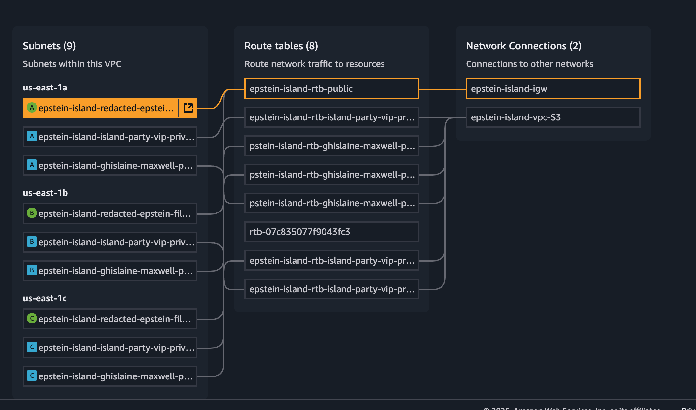

---
## Create Security Groups

### 1) `bastion-sg` (for Windows bastion host - public)
- Inbound Rules
	- RDP (3389), Source: `YOUR_PUBLIC_IPv4`
- Outbound Rules (Default), DO NOT TOUCH

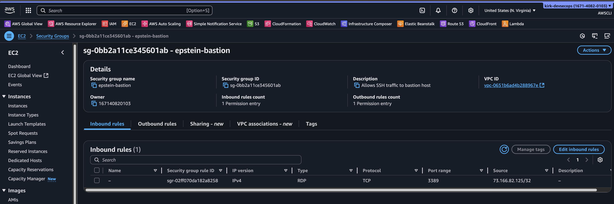
### 2) `private-app-sg` (for Linux clients - private)
- Inbound Rules
	- HTTP (80), Source: `bastion-sg`
	- SSH (22), Source: `bastion-sg`
- Outbound Rules (Default), DO NOT TOUCH

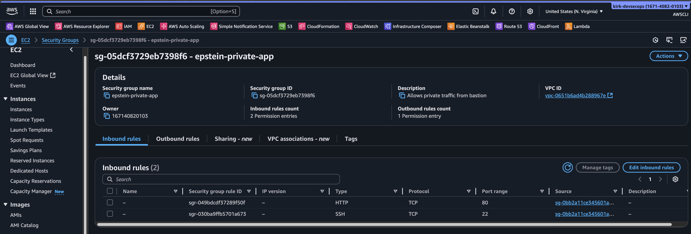

> The `bastion-sg` security group ID must be the source for all inbound rules in `private-app-sg`. This limits inbound traffic to the bastion host and prevents others from accessing the Linux clients.

---
## EC2 Deployment
### Launch the Bastion Host
1. Console → EC2 → Launch instance.
2. AMI: Windows Server (choose a recent Windows AMI).
3. Instance type: `t3.micro.`
4. Networking: choose a public subnet, enable Auto-assign Public IP.
5. Security group: `bastion-sg`.
6. Key pair: select (or create) a PEM key pair. Download the `.pem` file.
7. Launch instance.

### Launch the Linux clients
1. Console → EC2 → Launch instance.
2. AMI: Amazon Linux 2.
3. Instance type: `t3.micro`.
4. Networking: choose a private subnet, do not assign public IP.
5. Security group: `private-app-sg`.
6. Key pair: reuse the same key pair as the bastion for simplicity (choose different keys for better security).
7. Add **User Data** script for each instance
	- Instance 1: SCRIPT 1
	- Instance 2: SCRIPT 2
	- Instance 3: SCRIPT 3
8. Launch instance
9. Repeat for each Linux client

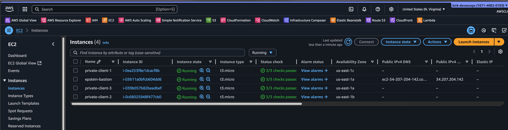

> Make sure your private instances do not have a public IP. If they do, terminate and follow the instructions closely.

---
## Access Credentials and Set up Connection  to Bastion Host

### Download the RDP file and decrypt Administrator password 
1. In EC2 Console, open the bastion details and select → **Connect** 

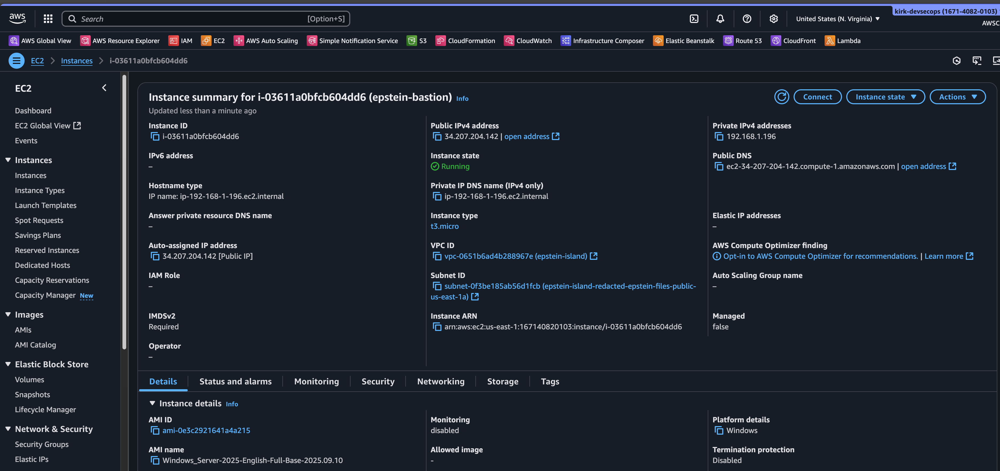

2. Click → **RDP client**.
3. **Download Remote Desktop File (.rdp)**.

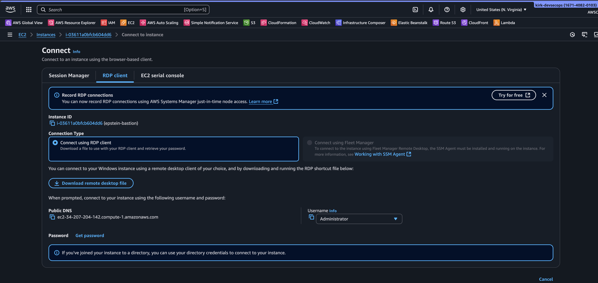

4. Click **Get Windows Password**.

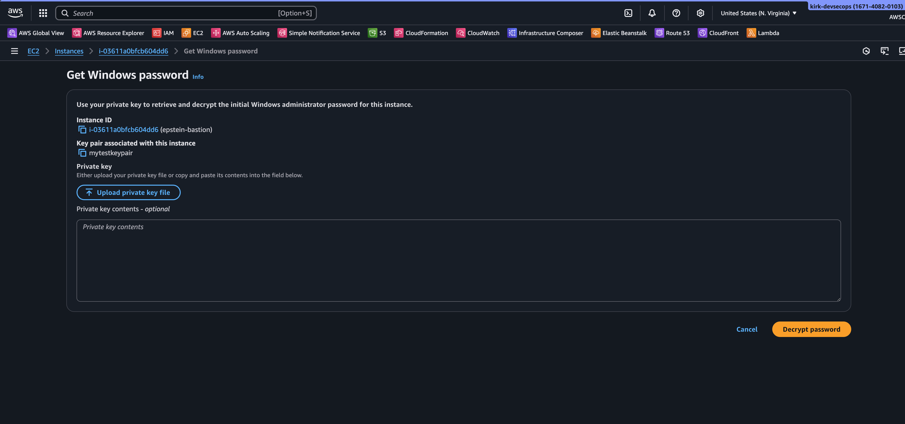

5. Upload your **private key file (.pem)** (the key pair you selected at launch).
6. Click **Decrypt Password** and copy the **Administrator** password.
7. Store the password in a secure password vault.

### Download RDP client
1. Download an RDP client for your OS.
	https://docs.aws.amazon.com/AWSEC2/latest/UserGuide/connect-rdp.html
### Open RDP client (local)
- Open the downloaded `.rdp` file with your RDP client, then enter the decrypted password when prompted.
- Depending on your RDP client, you may need to input the following in lieu of a `.rdp` file.
    - PC Name / IP Address: enter the bastion's public IP address
    - Credentials:
        - Username: `Administrator`
        - Password: enter the decrypted password
---
## Optional: Add persistent credentials (Microsoft Remote Desktop)
1. Open Microsoft Remote Desktop client on your local computer.
2. Click *Add PC*.

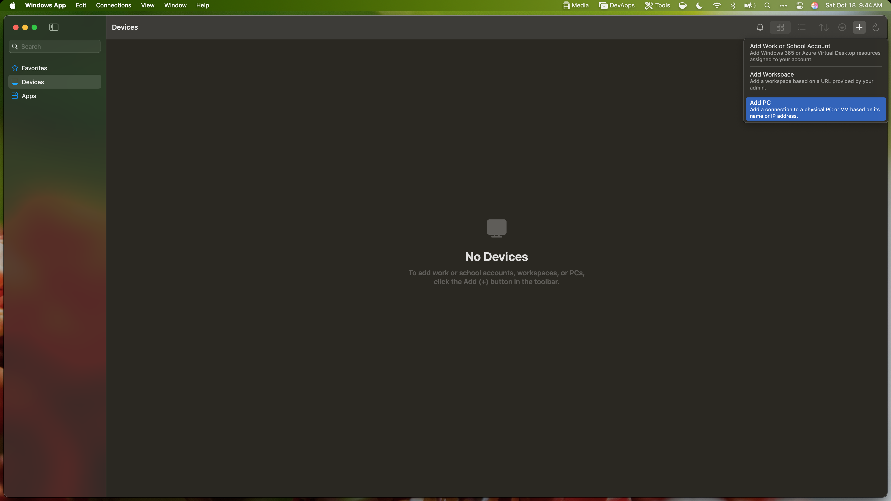

3. PC Name: enter the bastion's public IP address
4. Under credentials → Add:
    - Username: `Administrator`
    - Password: enter the decrypted password
    - Friendly name: enter whatever you like (optional)
5. Save and double-click the tile to connect.

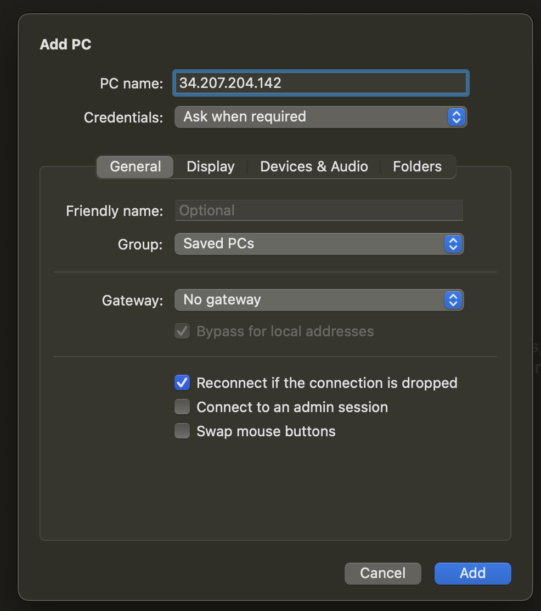

## Once Connected, you should be logged into the bastion host


## Transfer the SSH key  to the bastion and Open PowerShell

> You will need to transfer the `.pem` file to the Windows bastion to use SSH and connect to the private Linux instances.
1. On your local machine
	- locate the `.pem` file (commonly saved in `~/.ssh` folder in the user's profile directory.
	- Copy the file
2. From the RDP session
	- open File Explorer and navigate to `C:\Users\Administrator\`
	- Paste the `.pem` file there.

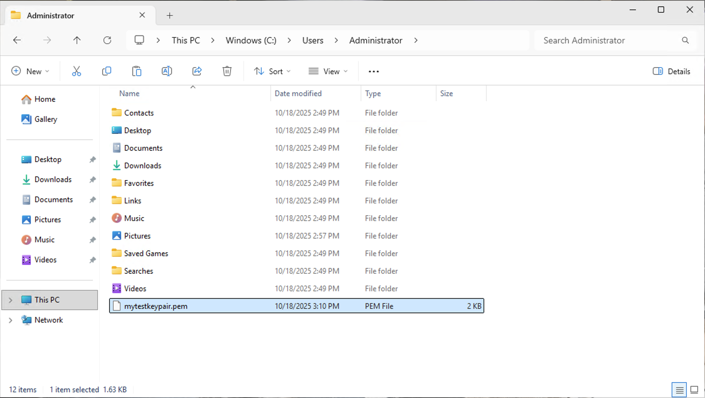

---
## Test  Connections to Private Linux Clients
#### While still in the RDP session on the windows bastion host

### Test HTTP Connectivity
1. Open **Microsoft Edge** on the desktop.
2. Enter the IP address of the first Linux client, in the address bar:
3. Press **Enter**. The client’s web server page should load successfully. This confirms successful HTTP connection via the bastion host.

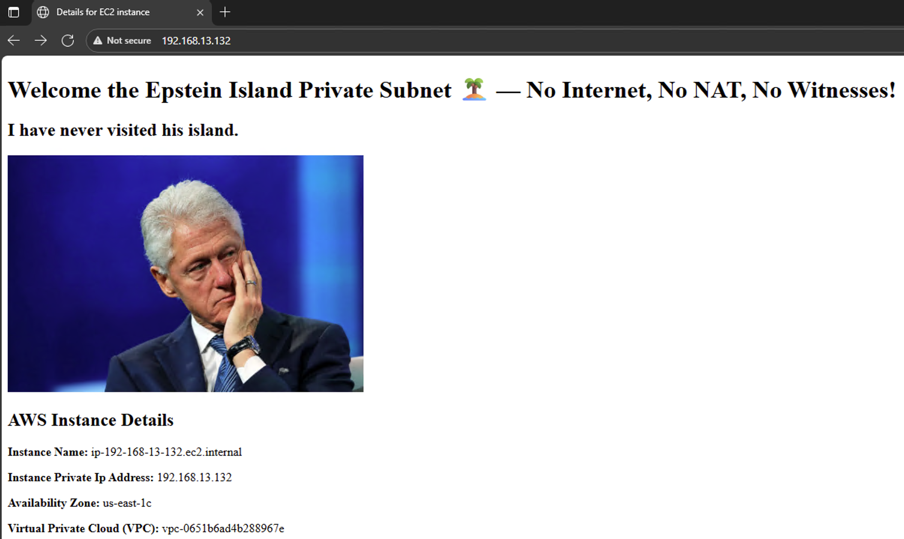

4. Repeat this test for each remaining Linux client:

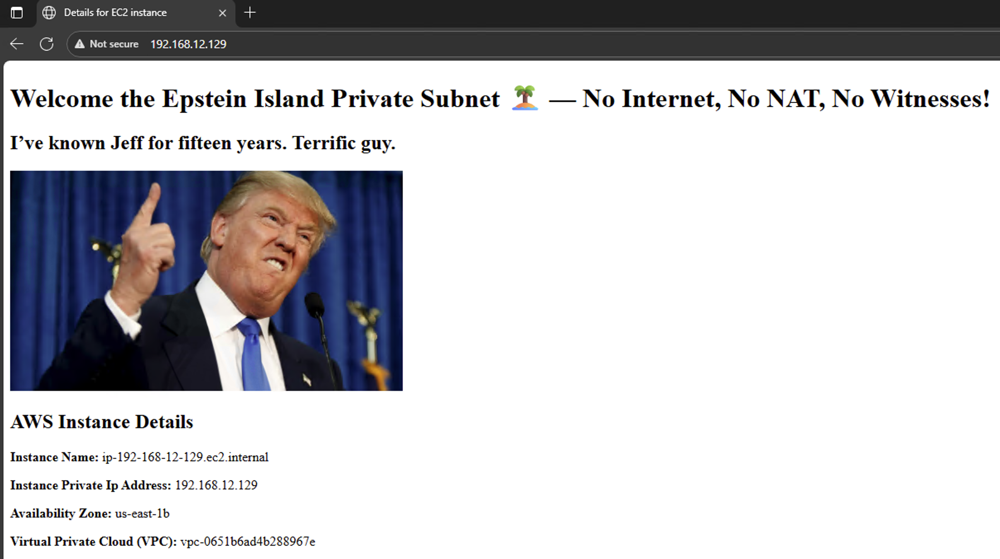

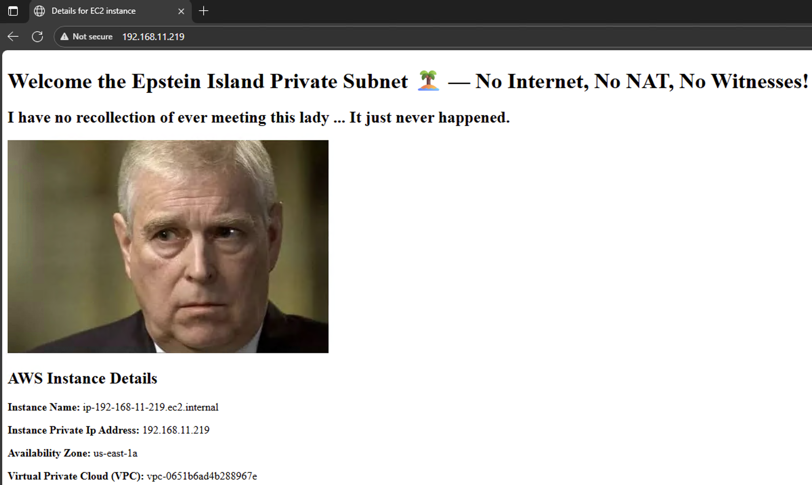

### **Initialize SSH on the Windows Bastion**
1. Click the **Windows** button and search for **“ssh”**.
2. Click **“Open as Administrator.”**

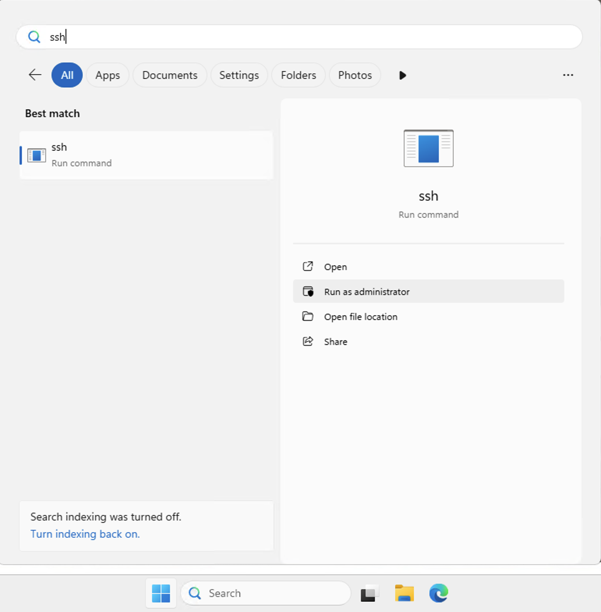

3. Wait a few seconds for the SSH client window to launch. It may flash briefly on the screen.
4. Once it closes automatically click the Windows button and open **PowerShell**.

### Test SSH SSH Connectivity
1. In PowerShell navigate to the directory with the `.pem` file (for accessing Linux clients)

``` PowerShell
cd C:\Users\Administrator
```

2. SSH Into the first Linux Client

```powershell
ssh -i <keypair>.pem ec2-user@<PrivateClientIP>
```

3. The connection will prompt to accept host fingerprint: type `yes`.

4. Confirm network isolation with a ping test

```bash
ping 8.8.8.8
```

- If properly isolated, this should **time out**.
- 
5. Terminate the ping with `control + c` and confirm 100% packet loss.
	- This packet loss is proof that the private instance has no direct Internet access.
6. Type `exit` to sign out.

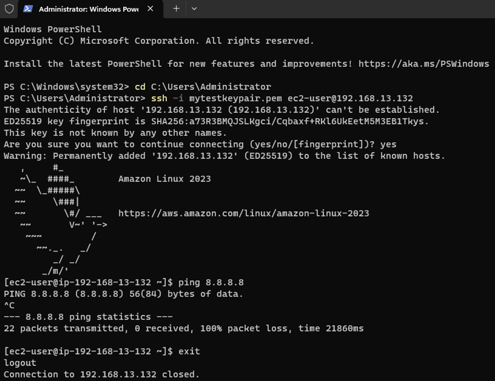

7. Repeat this process for all remaining Linux clients.

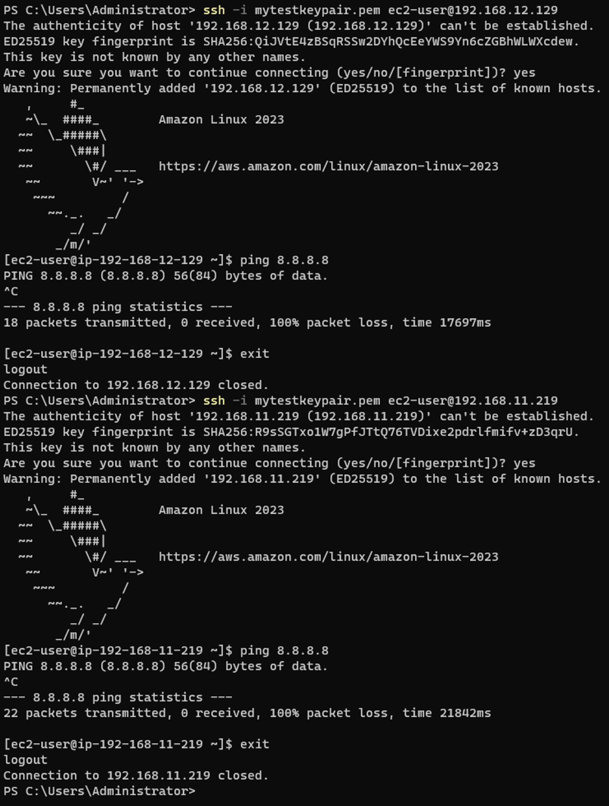

---
## Teardown Instructions
1. Terminate all EC2 instances (bastion + private clients).
2. Delete the VPC resources:
    - Subnets, route tables, Internet Gateway, etc.
3. Delete Security Groups (if not auto-removed).
4. Remove saved RDP credentials from your local RDP client.

# When finished: Sign out of AWS, forget everything you saw, and pray the federal government doesn't come looking for you. 🙏🏾✈️🌏

---
## References

- Amazon EC2 key pairs and Amazon EC2 instances
	https://docs.aws.amazon.com/AWSEC2//UserGuide/ec2-key-pairs.html
- Connect to your Windows instance using an RDP Client:
	https://docs.aws.amazon.com/AWSEC2/latest/UserGuide/connect-rdp.html